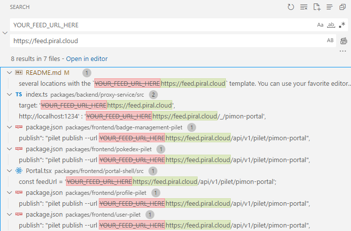
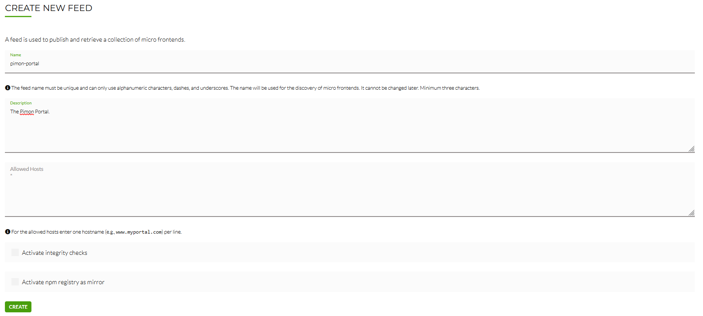
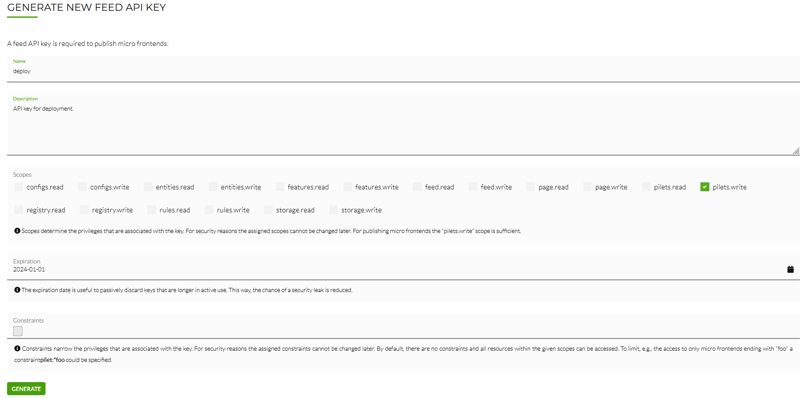
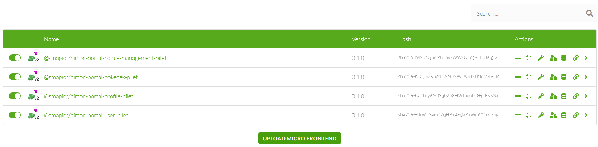
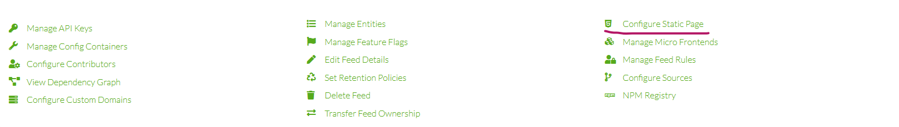

[](https://piral.io)

# [Piral Sample](https://piral.io) &middot; [](https://github.com/smapiot/piral/blob/main/LICENSE) [](https://gitter.im/piral-io/community)

> Pimon Portal

:zap: The Pimon Portal from the Microfrontends Meetup in August, 2023. Demonstrates several capabilities of the [Piral Feed Service](https://www.piral.cloud/).

📹 **Watch the Video:**  
You can watch a recording of the meetup where this portal was demonstrated [on YouTube](https://www.youtube.com/watch?v=MN35_drIchE). If you do not know what the Pimon Portal is about, we recommend watching the corresponding section (starting _~43:15_) of the meetup.

> **⚠️ Important:**  
> Be aware that the code in this repository is, at the moment, in a "non-production, tuned-for-presentations" state, meaning that there are several locations which are not optimal, to say the least. The focus of this portal lies on demonstrating several features of the [Piral Feed Service](https://www.piral.cloud/). No explicit focus was put on developing production-ready code or top-quality backend services.

## Getting Started

To clone and initialize the repository, execute the following steps:

```sh
# Clone the repository (you can also use HTTPS here).
git clone git@github.com:piral-samples/pimon-portal.git
cd pimon-portal

# Install git submodules.
# The repository includes https://github.com/PokeAPI/sprites as a submodule.
git submodule init
git submodule update

# Install dependencies.
npm i
```

Next, you need to make the portal/code aware of the feed service that you are using. The code contains several locations with the `YOUR_FEED_URL_HERE` template. You can use your favorite editor's _"Find and Replace All"_ functionality to replace this placeholder with the URL of your feed service (for example, [`https://feed.piral.cloud`](https://feed.piral.cloud)). You should find and replace the following locations:



The portal assumes that it is deployed into a feed called **`pimon-portal`**. When you create a feed in the feed service, ensure that you name it accordingly. For reference, this is how a reference feed creation screen looks like:



To publish the portal's assets into the feed service, you must first create an API key. This can be done via the feed service's UI. You can use the following image as reference:



The created API key can be stored in a `.piralrc` file. Storing it inside this file makes it accessible to the Piral CLI (and transitively, to all deployment related commands). To do so, create a `.piralrc` file in the repository's root directory. The file should contain the following content:

```json
{
  "apiKey": "YOUR_API_KEY_HERE"
}
```

With the API key in place, the portal can now be built and published. To do so, run the following commands, in order:

```sh
# To build all packages.
npm run build

# To pack all micro frontends into .tar files which can be uploaded to the feed service.
npm run pack

# To publish the packed files.
npm run publish
```

If everything went right, your feed should now contain a list of all micro frontends:



At last, you need to upload the portal's app shell's static files. This can be easily be done manually via the feed service's UI. Navigate to your feed and click on _"Configure Static Page"_:



On the following page, select _"Custom"_, enter an unused version (the default, 1.0.0, is typically fine) and upload _all_ files contained in `packages/frontend/portal-shell/dist/release` on the following steps.

If everything went well, the portal can now be accessed! 🎉

The only thing you need is the backend services running locally. Run `npm start` and, once all processes have started, navigate to [http://localhost:3000](http://localhost:3000).

## Portal Accounts

The portal contains the following user accounts which you can use for logging in:

| Username | Password    | Role         |
| -------- | ----------- | ------------ |
| `admin`  | `Admin123`  | `admin`      |
| `brock`  | `Brock123`  | `gym-leader` |
| `misty`  | `Misty123`  | `gym-leader` |
| `ash`    | `Ash123`    | `trainer`    |

## License

Piral and this sample code is released using the MIT license. For more information see the [license file](./LICENSE).
