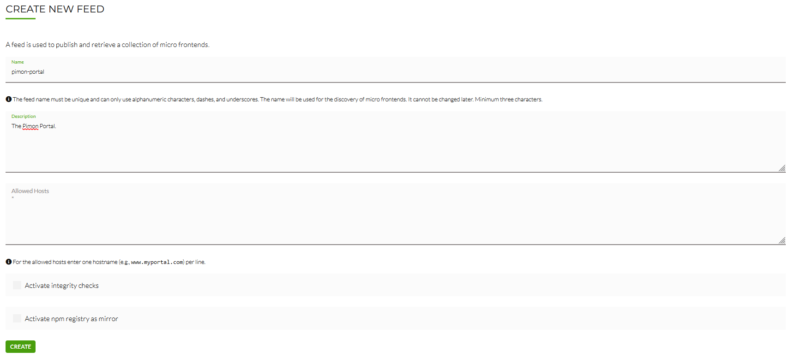
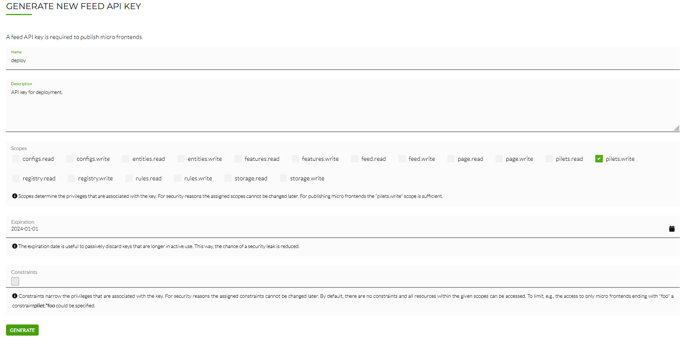
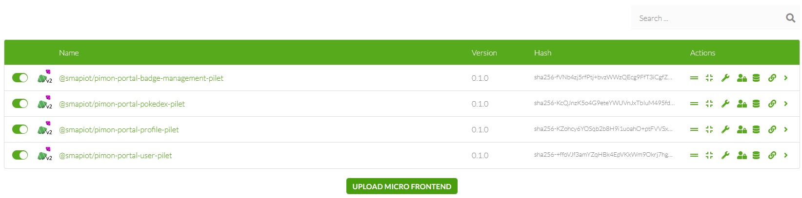
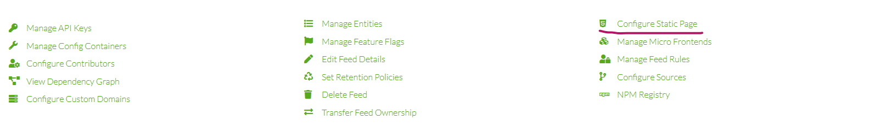

[](https://piral.io)

# [Piral Sample](https://piral.io) &middot; [](https://github.com/smapiot/piral/blob/main/LICENSE) [](https://gitter.im/piral-io/community)

> Pimon Portal

:zap: The Pimon Portal from the Microfrontends Meetup in August, 2023. Demonstrates several capabilities of the [Piral Feed Service](https://www.piral.cloud/).

📹 **Watch the Video:**  
You can watch a recording of the meetup where this portal was demonstrated [on YouTube](https://www.youtube.com/watch?v=MN35_drIchE). If you do not know what the Pimon Portal is about, we recommend watching the corresponding section (starting _~43:15_) of the meetup.

> **⚠️ Important:**  
> Be aware that the code in this repository is, at the moment, in a "non-production, tuned-for-presentations" state, meaning that there are several locations which are not optimal, to say the least. The focus of this portal lies on demonstrating several features of the [Piral Feed Service](https://www.piral.cloud/). No explicit focus was put on developing production-ready code or top-quality backend services.
>
> If you want to help improve the quality of the code and/or add cool new features that improve this demo portal, feel free to open a pull request! ♥️

## Getting Started

To clone and initialize the repository, execute the following steps:

```sh
# Clone the repository (you can also use HTTPS here).
git clone git@github.com:piral-samples/pimon-portal.git
cd pimon-portal

# Install git submodules.
# The repository includes https://github.com/PokeAPI/sprites as a submodule.
git submodule init
git submodule update

# Install dependencies.
npm i
```

Then, create a feed for the portal within the feed service. For reference, this is how a reference feed creation screen looks like:



Next, configure pilet publishing in the root `.piralrc` file (the file must be created first). For `url`, use the complete pilet publishing endpoint:

```json
{
  "url": "YOUR_FEED_URL_HERE/api/v1/pilet/pimon-portal",
  "apiKey": "YOUR_API_KEY_HERE"
}
```

To publish the portal's assets into the feed service, you must first create an API key. This can be done via the feed service's UI. You can use the following image as reference:




At last, create a root `.env` file with remaining configurations:

```env
FEED_SERVICE_URL=https://feed.piral.cloud.com
FEED_NAME=pimon-portal
PAGE_API_KEY=YOUR_PAGE_API_KEY_HERE
```

With the configs in place, the portal can now be built and published. To do so, run the following commands, in order:

```sh
# To build all packages.
npm run build

# To pack all micro frontends into .tar files which can be uploaded to the feed service.
npm run pack

# To publish the packed files.
npm run publish
```

If everything went right, your feed should now contain a list of all micro frontends:



At last, you need to upload the portal's app shell's static files. This can be easily be done manually via the feed service's UI. Navigate to your feed and click on _"Configure Static Page"_:



On the following page, select _"Custom"_, enter an unused version (the default, 1.0.0, is typically fine) and upload _all_ files contained in `packages/frontend/portal-shell/dist/release` on the following steps.

If everything went well, the portal can now be accessed! 🎉

The only thing you need is the backend services running locally. Run `npm run start:be` and, once all processes have started, navigate to [http://localhost:3000](http://localhost:3000).

## Portal Accounts

The portal contains the following user accounts which you can use for logging in:

| Username | Password    | Role         |
| -------- | ----------- | ------------ |
| `admin`  | `Admin123`  | `admin`      |
| `brock`  | `Brock123`  | `gym-leader` |
| `misty`  | `Misty123`  | `gym-leader` |
| `ash`    | `Ash123`    | `trainer`    |

## Feed Service Configuration Summary

To fully configure the portal within the feed service, the following options must be configured:

### Configure Rules

- Allow `@smapiot/pimon-portal-user-pilet` only when the JWT `roles` claim contains `admin`.
- Allow `@smapiot/pimon-portal-badge-management-pilet` only when `roles` contains `gym-leader` or `admin`.

### Configure Entities

- Add `menu-general` entities to order the menu: `pokedex` (0), `profiles` (1), and `users` (2).

### Configure Configs

- Configure `@smapiot/pimon-portal-pokedex-pilet` with `pokedexSize: 151` and `pokemonOfTheDay: 54`.

### Configure Feature Flags

- Create and enable `pokedex-moves` to show the Moves section on Pokémon detail pages.

## Local Development

Local development happens without the feed service, but still leverages the proxy service. To make the proxy service use the local dev server instead of the feed service, navigate to the `packages/backend/proxy-service/src/index.ts` file and change the `const useDevServer = false;` line to `const useDevServer = true;`. This will make the service forward asset-related requests to to `localhost:1234`, i.e., the default port on which a Piral application is started locally. Once changed, simply run `npm start` to begin your local dev session.

## License

Piral and this sample code is released using the MIT license. For more information see the [license file](./LICENSE).
